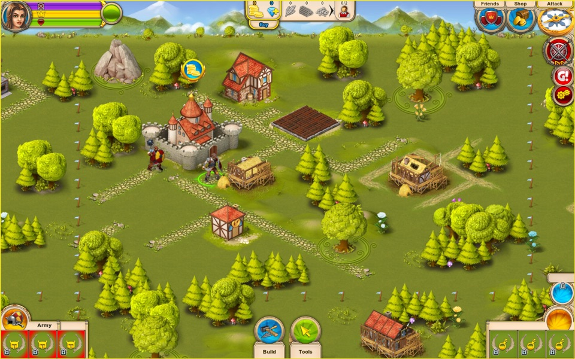
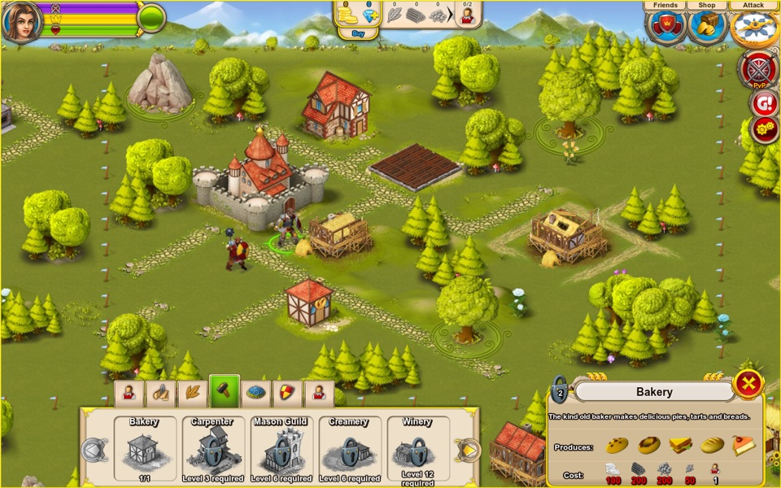
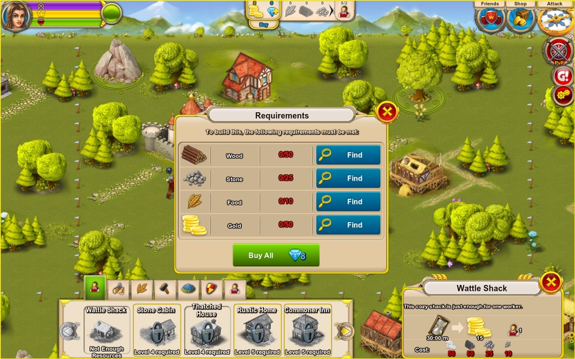

# RTKContinued

A native, open-source C++ port of **Rule the Kingdom**, rebuilt function by function from the
original Android 5.11 game library so the game can be played again on modern computers.



## The game that was

Rule the Kingdom was published by **Game Insight** and developed by **innoWate** in 2012. It called
itself "an unprecedented blend of RPG action, city-building, farming and storytelling": you led a
hero and a squad of warriors through forests, deserts and tundra, cast spells, found hundreds of
items and enhanced them with magical gems, and built up a kingdom whose subjects gathered
resources, farmed and ran workshops. It shipped on Android through Google Play, and later on iOS,
Windows 8, Windows Phone and Facebook. The last Android version, 5.11, dates from October 2014.

Like many free-to-play games of its era, it depended on its publisher's servers: saves, events,
friends, PvP and purchases all went online. When those services ended, the game could no longer be
played as it was. No server data or content beyond version 5.11 survives, so this project brings
back what the game files themselves contain.

| The shop | Requirements |
|---|---|
|  |  |

## Scope

- **A faithful port, not a remake.** Every function is translated from the original's code and
  tagged with its address (`// @0x...`); its formats, formulas and even its quirks are kept.
  Guesses are marked `UNVERIFIED`.
- **Offline first.** Everything that needed the server is rebuilt to run locally: seasonal events
  follow the calendar, crystals are earned in play (daily rewards, chests, quests) instead of bought,
  and the arena, PvP and friends will work offline. Online code is kept dormant so a community
  server could be added later. There are no real-money purchases.
- **Platforms:** macOS, Linux and Windows (Android possibly later), with SDL3 and OpenGL.
- **Saves** stay in the original's format.
- **No game data is included.** You need your own copy of the original files (the 5.11 Android
  APK assets and the `.kbf` expansion packs). This repository holds only the port's source and the
  tools that read the original formats.

**Status:** work in progress (milestone 4 of 7). The city, HUD, workers, economy, farms, shop,
saves, the hero and his army, and items work; quests, campaign maps and combat are next. See
[STATUS.md](STATUS.md) for the detailed progress and plan, and
[docs/port_inventory.md](docs/port_inventory.md) for where every part of the original goes.

## Building (macOS)
Requirements: CMake 3.20+, a C++17 compiler, and SDL3, pugixml, libpng, libjpeg and zlib
(e.g. `brew install cmake sdl3 pugixml libpng jpeg-turbo zlib`). FreeType 2.4.5 and SDL_ttf 2.0.11
are bundled in `third_party/`.

```
cmake -S . -B build
cmake --build build -j8
./build/rtk --root <folder containing the game data>
```

## Layout
- `src/` the port (engine, game logic, GUI, HUD, windows)
- `tools/` Python/Ghidra tools for the original's formats and for reading the decompile
- `docs/` working notes
- `third_party/` bundled libraries

## Reverse-engineering workspace

Code base: Android 5.11 `libkingdom.so` (ARMv7, Oct 2014, about 10.5k exported C++ symbols).
Primary data: the 5.11 APK `assets/data`. Secondary: the Win8 5.0.0.39 Appx and the `.kbf` expansion packs.

## Layout
- `tools/rtk_extract.py`: extracts the resource containers (Android `.jet`, Win8 `res_data.bin`, `.kbf`).
- `tools/ghidra_headless.sh`: runs Ghidra headless with the Homebrew JDK 21.
- `tools/ghidra_scripts/ExportDecomp.java`: dumps decompiled C for every function.
- `ghidra/`: the Ghidra project (`rtk511`), which can be opened in the GUI with `ghidraRun`.
- `out/`: generated output (assets, `decomp.c`, `functions.tsv`). It can be regenerated at any time.

## Regenerate
```
python3 tools/rtk_extract.py android "../Android files/rule-the-kingdom-5-11-multi-android/assets/data" out/assets/android511
python3 tools/rtk_extract.py win8    ../_extract/win5/Assets                            out/assets/win8
python3 tools/rtk_extract.py kbf     ../files/main.27.kbf                               out/assets/kbf_main27
tools/ghidra_headless.sh "$PWD/ghidra" rtk511 -import "../Android files/rule-the-kingdom-5-11-multi-android/lib/armeabi-v7a/libkingdom.so" \
    -scriptPath "$PWD/tools/ghidra_scripts" -postScript ExportDecomp.java "$PWD/out"
```

## Container format (verified on every entry)
Index entry: `u32 name_len` (includes the NUL), then the name, then 8 little-endian `u32` fields:
`hash, width, height, is_data, bpp, offset, size, chunk`.
- Android: payload is in `data/<chunk>.jet`. `offset` is global, so subtract the smallest offset of any entry in that chunk.
- Win8: payload is at `res_data.bin[offset:offset+size]`.
- KBF: header `u32 magic=0x75B4A351, u32 index_size, 3×u32`, then the index, then data at `20 + index_size + offset`.
- XML, xmlb, map `.bin` and TTF payloads are gzipped on Android (and some on Win8).
